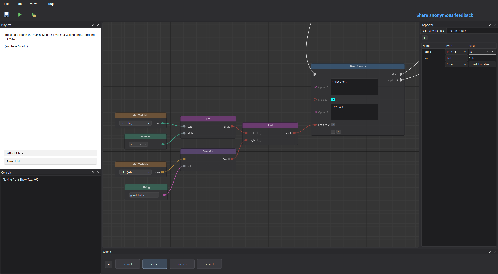
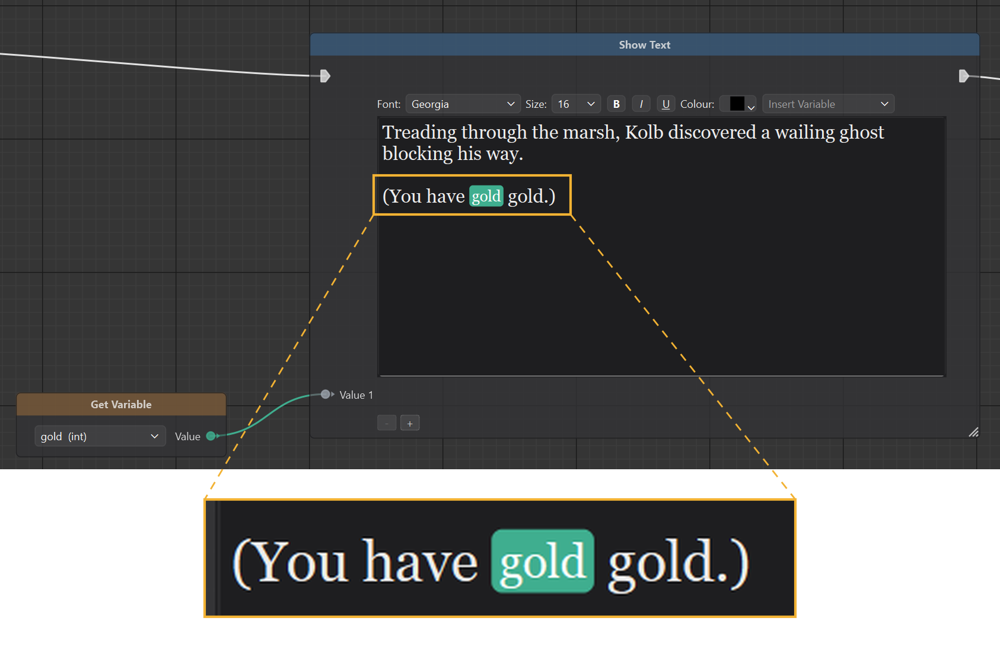
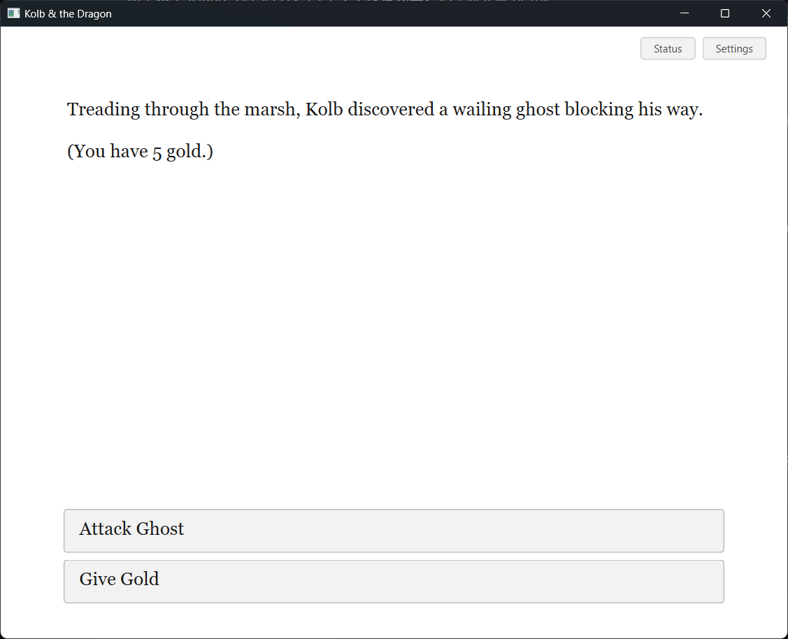

# Loom

A Windows desktop editor and player for text-centred, choice-driven interactive fiction. Loom lets authors build a story from connected nodes, test it inside the editor, and export it as a standalone game.

[](docs/images/editor-enable.png)

The canvas is more than a diagram of the story: its graphs, node values, and named connections are stored in a `.loom` project and interpreted by both the editor's playtest panel and the standalone player. Flow connections determine what happens next; data connections supply values to conditions, story state, and prose.

## Features

- Build multi-scene stories with choices, conditional routes, and scene transitions.
- Declare story variables and combine comparison, Boolean, arithmetic, and list operations as nodes.
- Write formatted passages and insert connected values directly into the text.
- Inspect structural diagnostics and playtest changes without leaving the editor (`F5`, or `Shift+F5` from one selected node).
- Export a Windows game folder containing the player, project, and required Qt runtime files. The player supports save and load files (`.loomsave`).

| Authoring a value slot | Playing the exported story |
| --- | --- |
| [](docs/images/prose-value-slot.png) | [](docs/images/standalone-game-before-gold-taken.png) |

## Try it

1. Download and extract the [packaged Windows build](https://drive.google.com/file/d/1GOy3jnnlvqHmNw78Pm2vKdL-mCQQsUGg/view?usp=sharing). Keep the extracted folder together; the editor needs its accompanying runtime files for export.
2. Run `LoomEngine.exe` and use **File → Open Story** to open the included `Example.loom`. The same example is available at [`stories/Example.loom`](stories/Example.loom) in this repository.
3. Press **F5** to playtest. Change a node or a connection, then playtest again to see its effect.
4. Use **File → Save** to persist the project. To make a distributable game, choose **File → Export Game…**, enter a game name, and choose a destination folder. Run the generated `.exe` from that folder.

The example adapts *Kolb & the Dragon* from *The Elder Scrolls V: Skyrim* to exercise Loom's branching, state, and prose features. [Original story reference](https://en.uesp.net/wiki/Skyrim:Kolb_%26_the_Dragon).

## Build from source

The source build targets Windows. It requires CMake 3.20+, a C++17 compiler, Qt 6 with Widgets, and a build tool such as Ninja. Use a compiler that matches your Qt installation, and make the Qt and compiler `bin` directories available on `PATH` when running the applications. CMake fetches the pinned QtNodes revision and the JSON library; enabling tests also fetches Catch2, so the first configuration needs network access.

From the repository root, substitute the path to your Qt kit:

```powershell
cmake -S . -B build -G Ninja -DCMAKE_PREFIX_PATH="C:/path/to/Qt/6.x.x/mingw_64" -DLOOM_BUILD_TESTS=ON
cmake --build build
ctest --test-dir build --output-on-failure --no-tests=error
```

The executables are `build/apps/editor/LoomEngine.exe` and `build/apps/player/LoomGame.exe`. The latter can open a `.loom` file passed as an argument. Exporting from the editor also needs the built player and Qt's `windeployqt.exe`; leave the build-tree directory structure intact.

## How it is organised

| Directory | Responsibility |
| --- | --- |
| [`core/value`](core/value) | Authored values and the JSON-library boundary |
| [`core/graph`](core/graph) | Projects, nodes, pins, connections, and structural diagnostics |
| [`core/nodes`](core/nodes) | Built-in node definitions |
| [`core/runtime`](core/runtime) | Graph traversal, runtime state, and save files |
| [`core/serialization`](core/serialization) | Reading and writing `.loom` projects |
| [`apps/editor`](apps/editor) | Qt editor and QtNodes canvas adapter |
| [`apps/player`](apps/player) | Standalone story player |
| [`tests`](tests) | Story-level integration tests |

The core is a set of C++17 libraries independent of the desktop UI. Both applications assemble the same node catalogue and use the same project representation and interpreter. QtNodes is confined to the editor's canvas; its port indices are converted to stable node and pin names when a project is stored.

## Current scope

Loom is a Windows-focused prototype for text-centred, choice-driven stories. It does not provide a general-purpose scripting language or a dedicated loop construct. The editor can save an unfinished project with structural errors, but such a file may be rejected when reopened. Resolve reported errors before closing the editor, and keep a backup of work in progress.
